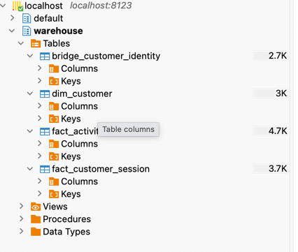
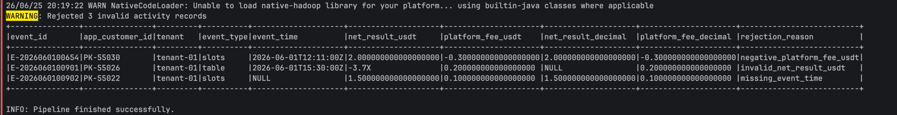
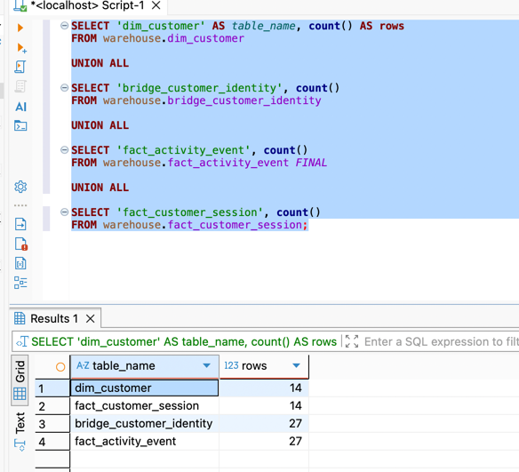
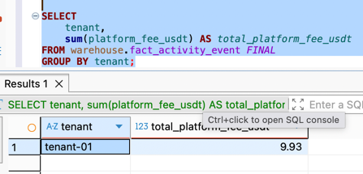
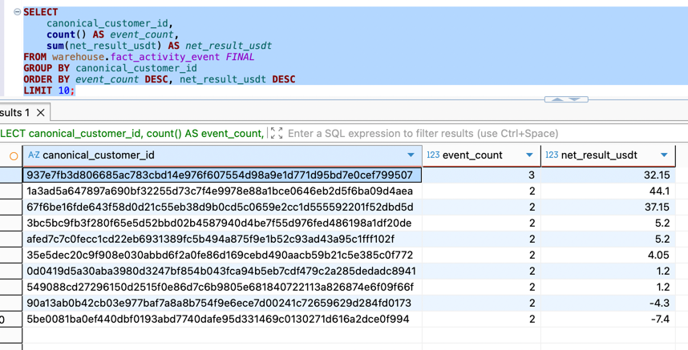
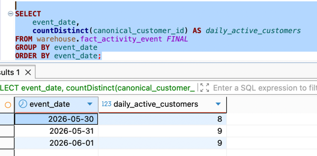

# Customer Activity Data Platform

## Overview

This project implements a small analytical data platform using **Apache Spark** and **ClickHouse**.

The pipeline ingests raw NDJSON datasets, validates incoming records, resolves customer identities across multiple source systems, builds an analytical warehouse model, and loads the results into ClickHouse for reporting and analytics.

The solution emphasizes correctness, reproducibility, idempotency, and maintainability while remaining intentionally lightweight for a take-home assignment.

---

## Features

- Apache Spark data processing pipeline
- ClickHouse analytical warehouse
- Customer identity reconciliation
- Deterministic identity resolution
- Data validation with rejection reasons
- Event deduplication
- Idempotent processing
- Star-schema inspired warehouse
- Docker-based reproducible environment
- Analytical KPI queries

---

## Architecture

```text
                    Sample Data (NDJSON)
                            │
                            ▼
                  Apache Spark Pipeline
                            │
        ┌───────────────────┼───────────────────┐
        │                   │                   │
        ▼                   ▼                   ▼
   Validation        Deduplication    Identity Resolution
                            │
                            ▼
                  Warehouse Transformation
                            │
        ┌───────────────────┼───────────────────┐
        │                   │                   │
        ▼                   ▼                   ▼
   dim_customer   bridge_customer_identity   Fact Tables
                            │
                            ▼
                       ClickHouse
                            │
                            ▼
                    Analytical Queries
```

---

## Technology Stack

- Python 3
- Apache Spark (PySpark)
- ClickHouse
- Docker Compose

---

## Warehouse

The analytical warehouse follows a star-schema inspired design and consists of four analytical tables:

- `dim_customer`
- `bridge_customer_identity`
- `fact_activity_event`
- `fact_customer_session`

Detailed modelling decisions, table grain, identity resolution, idempotency, and production considerations are documented in `docs/design_note.md`.

---

## Data Validation

Incoming records are validated before loading into the warehouse.

Validation includes:

- required fields
- timestamps
- decimal values
- duplicate activity events
- negative platform fees
- session consistency (`logout_at >= login_at`)

Rejected records receive a deterministic `rejection_reason`, are logged for auditing purposes, and are excluded from downstream analytical processing.

---

## Running the Project

### Prerequisites

- Docker
- Docker Compose

### Build the pipeline image

```bash
docker compose build pipeline
```

### Start ClickHouse

```bash
docker compose up -d clickhouse
```

### Execute the Spark pipeline

```bash
docker compose run --rm pipeline
```

The pipeline will:

- read all NDJSON files from `sample-data`
- validate incoming records
- reconcile customer identities
- build warehouse tables
- load analytical tables into ClickHouse

### Execute SQL queries

Example:

```bash
make query Q="SELECT count() FROM fact_activity_event FINAL"
```

You can also connect using any SQL client.

```text
Host: localhost
Port: 8123
Database: warehouse
User: dpe
Password: dpe
```

---

## KPI Queries

Example analytical queries include:

- Total platform fees by tenant
- Top customers by activity
- Daily Active Customers (DAC)

The SQL examples are available in:

```text
sql/kpi_queries.sql
```

The KPI queries use the `FINAL` modifier to ensure correct analytical results after repeated pipeline executions.

---

# Example Results

The screenshots below were captured after executing the pipeline against the provided sample dataset.

## Warehouse Schema

The analytical warehouse created by the pipeline.



---

## Pipeline Validation

Invalid records receive a deterministic `rejection_reason`, are logged during pipeline execution for auditing purposes, and are excluded from downstream processing.



---

## Warehouse Row Counts

Logical row counts after executing the pipeline.



---

## KPI Example — Total Platform Fees

Platform fees aggregated by tenant.



---

## KPI Example — Top Customers by Activity

Top customers ranked by activity count and total net result.



---

## KPI Example — Daily Active Customers

Daily Active Customers (DAC) across the sample period.



Running the pipeline multiple times inserts duplicate physical rows into ClickHouse. The warehouse uses `ReplacingMergeTree`, while analytical queries use the `FINAL` modifier to guarantee consistent logical results across reruns.

---

## What I Would Do with Another Day

Given additional time, I would extend the solution with:

- Spark Structured Streaming for sub-minute ingestion
- incremental processing
- Spark ClickHouse Connector for distributed loading
- Airflow orchestration
- unit and integration tests
- data quality monitoring
- monitoring and alerting
- CI/CD pipeline
- externalized configuration and secrets management (e.g. HashiCorp Vault or a cloud secrets manager instead of embedding connection details)

Additional architectural decisions, trade-offs, and production considerations are documented in `docs/design_note.md`.

---

## Repository Structure

```text
clickhouse/
docs/
├── design_note.md
└── images/
    ├── warehouse_schema.png
    ├── validation_log.png
    ├── warehouse_row_counts.png
    ├── kpi_platform_fees.png
    ├── kpi_top_customers.png
    └── kpi_daily_active_customers.png

kafka/
sample-data/
sql/
src/

Dockerfile
docker-compose.yml
Makefile
README.md
requirements.txt
```